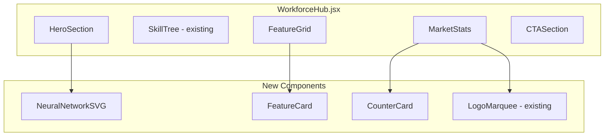

# Workforce Development Center Page

## Overview

Redesign [src/pages/discover/WorkforceHub.jsx](src/pages/discover/WorkforceHub.jsx) into a comprehensive dark-themed page with Stevens Red accents, subtle grid backgrounds, and glowing neon effects.

## Architecture




## Page Sections

### 1. Hero Section (60/40 Split)

**Layout**: CSS Grid with `grid-cols-5` (3 cols left, 2 cols right)

**Left Side (60%)**:

- Eyebrow: "WORKFORCE DEVELOPMENT CENTER"
- Heading: "Your Career, Engineered by Data."
- Subheading: "Our Workforce Development Center uses AI and labor market data..."
- Subtle animated gradient text effect on "Data"

**Right Side (40%)**:

- Animated Neural Network SVG with glowing nodes and pulsing edges
- Alternative: Abstract grid with floating data points

**Styling**:

```jsx
// Dark background with subtle grid
className="bg-gray-950 relative overflow-hidden"
// Grid overlay
<div className="absolute inset-0 bg-[url('/grid.svg')] opacity-10" />
```

### 2. Interactive Roadmap Section

**Already implemented** in [src/components/workforce-hub/SkillTree.jsx](src/components/workforce-hub/SkillTree.jsx)

**Updates needed**:

- Add section wrapper with heading "Explore Your Pathway"
- Keep existing sidebar + React Flow canvas implementation

### 3. Feature Grid (2x2 Layout)

**Location**: New component at `src/components/workforce-hub/FeatureGrid.jsx`

**4 Cards with content**:


| Card | Title                      | Focus                                     |
| ---- | -------------------------- | ----------------------------------------- |
| 1    | AI-Driven Navigation       | Real-time labor market data alignment     |
| 2    | Real-Time Market Alignment | Speed of business, agile curriculum       |
| 3    | Modular Stackability       | Workforce impact, credit stacking         |
| 4    | Strategic Partnerships     | Corporate partnerships, employer programs |


**Card Styling** (DNF/RPG aesthetic):

```jsx
<motion.div 
  className="bg-gray-900/80 border border-gray-700 rounded-xl p-6 
             hover:border-red-500/50 hover:shadow-lg hover:shadow-red-500/10
             transition-all duration-300 group"
  whileHover={{ scale: 1.02 }}
>
  {/* Glowing icon */}
  <div className="w-14 h-14 rounded-lg bg-red-500/10 border border-red-500/30 
                  flex items-center justify-center mb-4 
                  group-hover:bg-red-500/20 group-hover:border-red-500/50">
    <Icon className="w-7 h-7 text-red-500" />
  </div>
  <h3 className="text-xl font-bold text-white mb-2">{title}</h3>
  <p className="text-gray-400">{description}</p>
</motion.div>
```

### 4. Market Stats and Social Proof

**Counter Cards**:

- "98%" - Placement Rate
- "15%" - Avg. Salary Increase
- Additional stats as needed

**Styling** (large animated numbers):

```jsx
<div className="text-center">
  <motion.span 
    className="text-6xl md:text-7xl font-bold text-white"
    initial={{ opacity: 0, y: 20 }}
    whileInView={{ opacity: 1, y: 0 }}
  >
    98%
  </motion.span>
  <p className="text-red-400 text-sm uppercase tracking-wider mt-2">
    Placement Rate
  </p>
</div>
```

**Logo Marquee**:

- Reuse existing [LogoMarqueeSection](src/components/shared/sections/LogoMarqueeSection.jsx)
- Partner logos: Google, Amazon, Deloitte, etc.
- Dark background, white/monochrome logos

### 5. Call to Action Section

**Layout**: Centered with two buttons

**Buttons**:

1. Primary (filled): "Start Your Personalized Path" - Links to form/assessment
2. Secondary (outline): "Request Corporate Partnership" - Links to corporate page

**Styling**:

```jsx
<section className="bg-gradient-to-b from-gray-900 to-gray-950 py-24">
  <div className="text-center max-w-3xl mx-auto">
    <h2 className="text-4xl font-bold text-white mb-4">
      Ready to Engineer Your Future?
    </h2>
    <p className="text-gray-400 mb-8">...</p>
    <div className="flex flex-col sm:flex-row gap-4 justify-center">
      <Button className="bg-red-600 hover:bg-red-700 text-white px-8 py-4">
        Start Your Personalized Path
        <ArrowRight className="ml-2" />
      </Button>
      <Button variant="outline" className="border-gray-600 text-white hover:bg-gray-800">
        Request Corporate Partnership
      </Button>
    </div>
  </div>
</section>
```

## Files to Create/Modify


| File                                                | Action | Description                                 |
| --------------------------------------------------- | ------ | ------------------------------------------- |
| `src/pages/discover/WorkforceHub.jsx`               | Modify | Complete page restructure with all sections |
| `src/components/workforce-hub/HeroSection.jsx`      | Create | 60/40 split hero with neural SVG            |
| `src/components/workforce-hub/NeuralNetworkSVG.jsx` | Create | Animated SVG component                      |
| `src/components/workforce-hub/FeatureGrid.jsx`      | Create | 2x2 feature cards                           |
| `src/components/workforce-hub/MarketStats.jsx`      | Create | Counter cards + logo marquee                |
| `src/components/workforce-hub/CTASection.jsx`       | Create | Dual-button CTA                             |


## Color Palette (Dark Theme + Stevens Red)

- Background: `gray-950` (#030712), `gray-900` (#111827)
- Text: `white`, `gray-400` (secondary)
- Accent: Stevens Red `#a32638` (use `red-600` or custom)
- Glow effects: `red-500/20`, `red-500/10`
- Borders: `gray-800`, `gray-700`
- Active/hover: `red-500/50` borders

## Animation Strategy (Framer Motion)

1. **Hero text**: Staggered fade-in from left
2. **Neural network**: Continuous pulse animation on nodes/edges
3. **Feature cards**: `whileHover` scale + glow intensity
4. **Stats counters**: `whileInView` count-up animation
5. **Logo marquee**: CSS infinite scroll (existing)

## Responsive Breakpoints

- Mobile: Single column, stacked sections
- Tablet (md): 2-column feature grid
- Desktop (lg): Full 60/40 hero split, 2x2 feature grid

